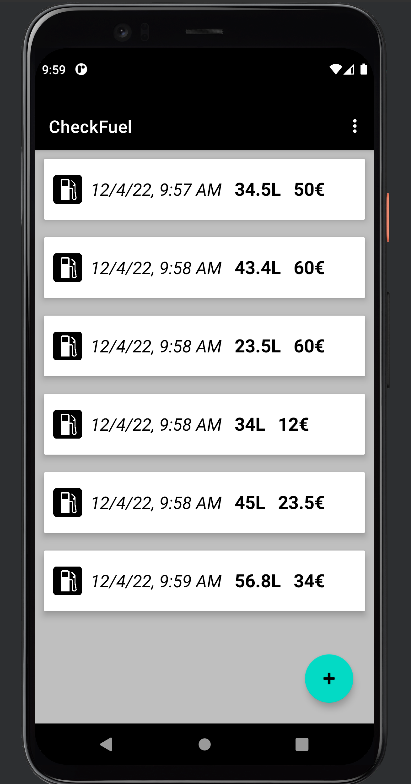

# CheckFuel

## Descripción

Aplicación móvil para Android que sirve para guardar la información del número de veces que repuestas gasolina. La aplicación ofrece una pantalla principal donde se visualiza un listado con la información (Fecha, Litros y Precio) de cada vez que le hechas gasolina al coche. Pudiendo eliminar todo en cualquier momento. En futuras actualizaciones, se añadira que se pueda calcular el total de litros y dinero gastado. 

## Table of Contents (Optional)

If your README is long, add a table of contents to make it easy for users to find what they need.

- [Installation](#installation)
- [Usage](#usage)
- [Credits](#credits)

## Installation

Descargar el achivo 'CheckFuel.apk' e instalar en el dispositivo android.

## Usage

A continuación, se muestran una serie de pantallas de la aplicación.

    

    Pantalla principal

## Credits

• https://developer.android.com/?hl=es-419

 •https://www.develou.com/guia-de-kotlin/
