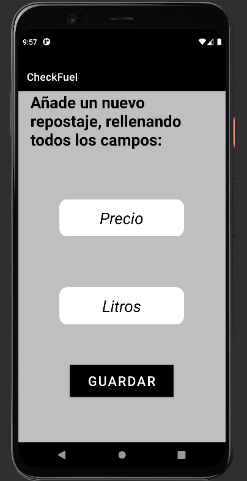

# CheckFuel

## Descripción

Aplicación móvil para Android que sirve para guardar la información del número de veces que repuestas gasolina. La aplicación ofrece una pantalla principal donde se visualiza un listado con la información (Fecha, Litros y Precio) de cada vez que repones gasolina al coche. Pudiendo eliminar todo en cualquier momento. En futuras actualizaciones, se añadira que se pueda calcular el total de litros y dinero gastado. 

## Tabla de contenidos

- [Instación](#installation)
- [Uso](#usage)
- [Créditos](#credits)

## Instalación

Descargar el achivo 'CheckFuel.apk' e instalar en el dispositivo android.

## Uso

A continuación, se muestran una serie de pantallas de la aplicación, así como una breve explicación de cómo usarlas.

Pantalla principal donde se muestra toda la información general. En la esquina inferior derecha, se encuentra el bóton con el que podemos añadir nuevos repostajes.

Pantalla para añadir la información principal de un repostaje. (LITROS y PRECIO en €). Si se pulsa el botón de 'Guardar' sin haber rellenado un campo salta un aviso, cuando se rellenen todos los campos se guarda la informacion permanentemente en el dispositivo.

Pantalla con todos los campos rellenados. Pudiendo guardar la información.

Pestaña que sirve para borrar todos los datos de la aplicación.

Pantalla sin ningún dato. Cuando instalamos la aplicación por primera vez aparece la misma pantalla.

## Créditos

 • https://developer.android.com/?hl=es-419

 • https://www.develou.com/guia-de-kotlin/
